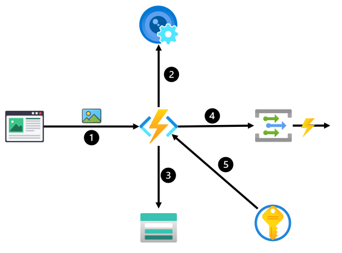
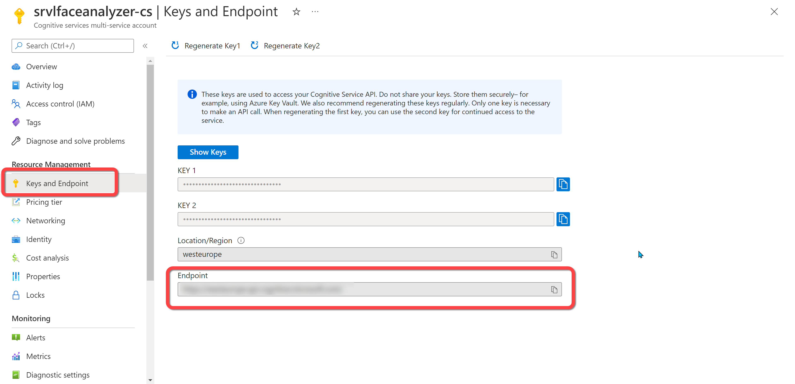
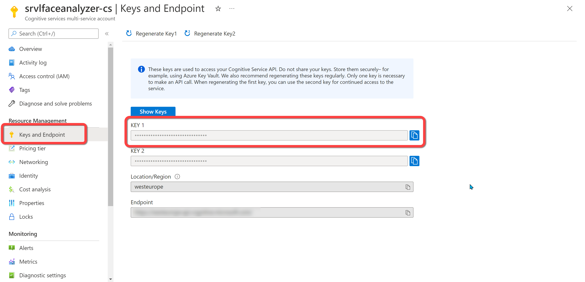
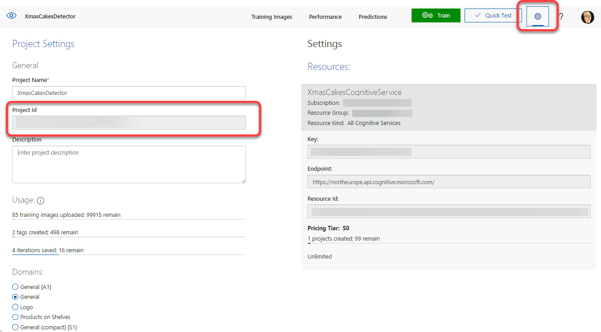
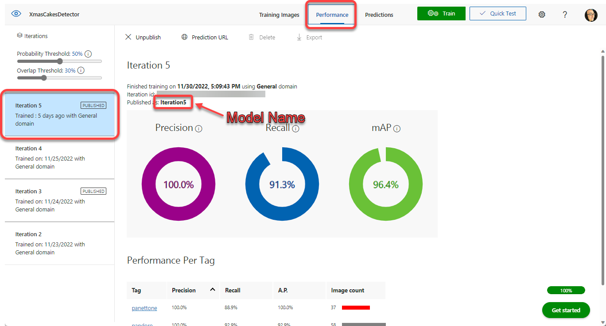
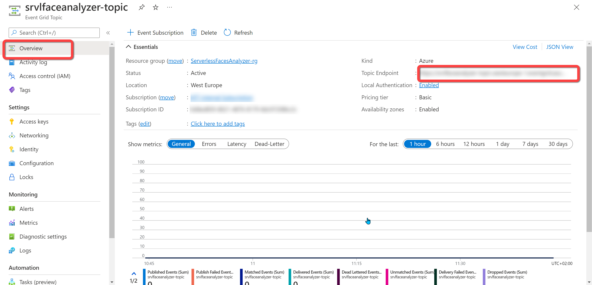
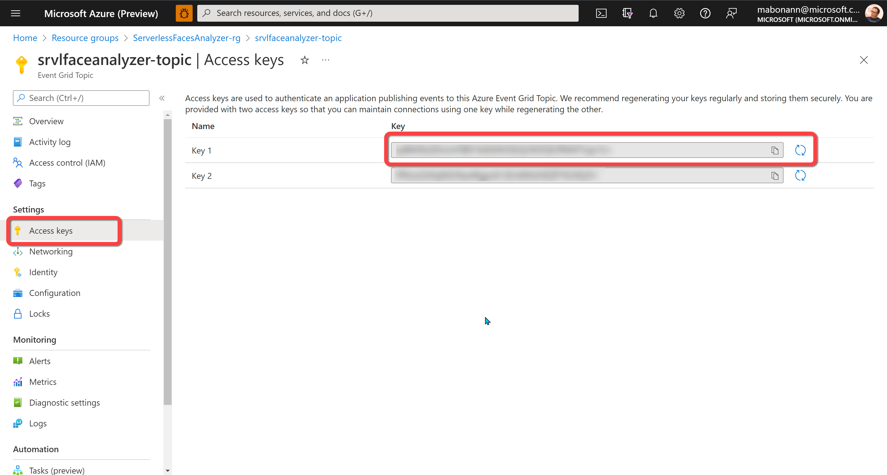

# Serverless Cakes Detector
This project is a simple implementation of a Serverless solution that uses Custom Vision (Objects Detection) to crop cakes from an uploaded image.

The solution allows user to upload an image using a HTTP call (POST multi-part), analyzes the image using a Custom Vision Object Detection ([here for documentation](https://learn.microsoft.com/en-us/azure/cognitive-services/Custom-Vision-Service/get-started-build-detector)) project , and for every cakes founded in the image (based on tags setting in the configuration), the solution crop the image of the cake from the original image and creates an image into a storage account.

## Architecture
This implementation uses one single Azure Functions to execute all the tasks.



1. The image is submitted through a POST HTTP call;
2. The function calls Custom Vision Services (Object Detection) to analyze the image;
3. The function uploads the original image on a specific folder in the Storage Account. The function generates an operation id (GUID) and uses it to create a folder in the storage account. The folder name contains the year, month and day (and the operation id) when the image is submitted. The Function uploads also the result (in JSON) and the object images extracted from the original image;
4. The function publishes an event to a Custom Event Grid topic to notify the event externally to the system;
5. All the sensitive information (like connection strings, service keys and so on) are stored in a Key Vault.

## Configuration
This is the `setting.json` file for the configuration:

```json
{
  "IsEncrypted": false,
  "Values": {
    ....
    "StorageConnectionString": "",
    "DestinationContainer": "faces",
    "FaceAnalyzer:ServiceEndpoint": "",
    "FaceAnalyzer:ServiceKey": "",
    "FaceAnalyzer:AgeThreshold": "18",
    "TopicEndpoint": "",
    "TopicKey": ""
  }
}
{
  "IsEncrypted": false,
  "Values": {
    ....
    "StorageConnectionString": "",
    "DestinationContainer": "cakes",
    "TopicEndpoint": "",
    "TopicKey": "",
    "ImageAnalyzer:PredictionEndpoint": "",
    "ImageAnalyzer:PredictionKey": "",
    "ImageAnalyzer:ProjectID": "",
    "ImageAnalyzer:ModelName": "Iteration5",
    "ImageAnalyzer:Threshold": 0.80,
    "AcceptedTags": "panettone;pandoro"
  }
}
```

* `StorageConnectionString` : This is the connection string of the storage where the images and the analysis results will be uploaded. This value can be a reference to a secret in the KeyVault. 
* `DestinationContainer` : This is the container in the storage account where the images and the analysis results will be uploaded. You can use `cakes` or a valid container name. The container must exist in the storage account.
* `ImageAnalyzer:PredictionEndpoint` : This is the endpoint of the Cognitive Service resource you use to analyze the source image (the prediction resource).  This value can be a reference to a secret in the KeyVault. You can find this value in the Cognitive Service resource blade in the Azure Portal as shown in the following figure:



* `ImageAnalyzer:PredictionKey` : This is one of the access keys of the Cognitive Service resource you use to analyze the source image (the prediction resource). This value can be a reference to a secret in the KeyVault. You can find this value in the Cognitive Service resource blade in the Azure Portal as shown in the following figure:



* `ImageAnalyzer:ProjectID` : This is the project ID of the custom model you use for object detection. This value can be a reference to a secret in the KeyVault. You can find this value in the <a href="https://www.customvision.ai/" target="_blank">Custom Vision Portal</a> (in the project settings view) as shown in the following figure:



* `ImageAnalyzer:ModelName` : This is the model name you you use for object detection.You set this name on your model iteration when you train your model, and you can find it in the <a href="https://www.customvision.ai/" target="_blank">Custom Vision Portal</a> (in the project settings view) as shown in the following figure:



* `ImageAnalyzer:Threshold` : This is the threshold you use to filter the objects detected in the original image. Only the objects with the tag in the `AcceptedTags` configuration value and threshold greater than this value will be extracted from the original image.

* `AcceptedTags` : Comma separated value that contains the tags you want to extract from the original image. The function will extract the objects with a tag in this property and threshold greater than the value in the `ImageAnalyzer:Threshold` setting.

* `TopicEndpoint` : This is the endpoint of the custom topic that the solution uses to emits event for the external services. This value must be a reference to a secret in the KeyVault. You can find this value in the Event Grid Topic resource blade in the Azure Portal as shown in the following figure:



* `TopicKey` : This is one of the access keys of the custom topic that the solution uses to emits event for the external services. This value must be a reference to a secret in the KeyVault. You can find this value in the Event Grid Topic resource blade in the Azure Portal as shown in the following figure:



